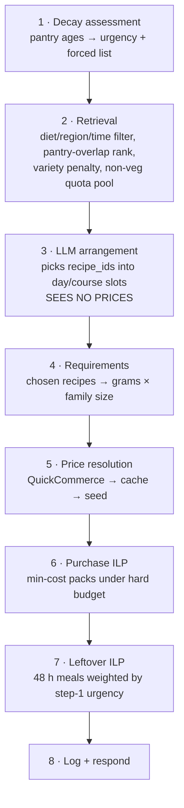

<title>MealMind — Documentation & KT</title>

# MealMind — Documentation & Knowledge Transfer

Budget-aware meal planner for Indian households. MDS482-4 capstone, Christ University.
**Current state: 105 tests passing · 2,019 Indian recipes · LLM planner verified live against Gemini · multi-user with JWT login · fully functional offline.**

---

## 1. The three problems it solves

1. **Overspending from fixed package sizes.** Recipes need 700 g of dal; shops sell 500 g packs. The mismatch forces surplus purchases. → An integer program buys the cheapest pack combination under a hard budget ceiling, computes the exact surplus, and a second integer program plans the next 48 hours of meals to consume it.
2. **Food waste from untracked spoilage.** Nobody logs every vegetable. → A Bayesian Weibull decay model estimates real-time spoilage risk from purchase date, item class and storage, and forces at-risk ingredients into the plan.
3. **Price volatility of Indian staples.** Static lists can't react to onion price shocks. → ARIMA(1,1,0) + GARCH(1,1) trained on 30 years of WFP monthly prices produce buy-now / wait advisories on the shopping list.

Problems 1 and 2 **couple**: the spoilage urgency from (2) is the objective coefficient of the 48-hour program in (1). That coupling is the project's central claim, guarded by `test_the_two_features_couple`.

---

## 2. System overview

**Stack:** FastAPI + SQLAlchemy 2 + SQLite (Python 3.11), PuLP/CBC for the integer programs, pure-stdlib `math` for the statistical models (no numpy/scipy/statsmodels anywhere), Pydantic v2 wire contract, httpx for the two outbound clients. Frontend is one static PWA file — no build step, no npm, no CDN.

```
backend/
├─ app/
│  ├─ main.py            app factory, CORS, /health
│  ├─ config.py          settings from .env
│  ├─ db.py              engine, session
│  ├─ models.py          10 tables
│  ├─ schemas.py         Pydantic request/response
│  ├─ repositories.py    ALL SQL lives here
│  ├─ presenter.py       inputs assembly + response serialisation
│  ├─ routers/           auth.py, pantry.py, plans.py, preferences.py (HTTP only)
│  └─ services/          the algorithms (no SQL, no HTTP concerns)
│     ├─ auth.py           PBKDF2 hashing + hand-rolled HS256 JWT
│     ├─ consumption.py    oldest-first stock draw when a meal is cooked
│     ├─ decay.py          (b) Weibull + conjugate posterior
│     ├─ optimizer.py      (a) both integer programs
│     ├─ variety.py        (c) dish-family entropy
│     ├─ forecast.py       (d) ARIMA + GARCH, pure Python
│     ├─ planner.py        retrieval, LLM/heuristic arrangement, pipeline
│     ├─ pricing.py        live → cache → seed resolution
│     └─ quickcommerce.py  price client + quantity parser
├─ scripts/
│  ├─ seed.py              28 hand-written recipes, prices, demo pantry
│  ├─ ingest_recipes.py    recipe CSV → recipes (Indian-only by default)
│  ├─ ingest_prices.py     WFP history → price_history
│  └─ ingredient_tables.py ★ THE tuning file: aliases, measures, cuisines
├─ tests/test_mealmind.py  105 tests, all offline
└─ run.sh                  start/replace the backend on :8000

frontend/
├─ index.html              the whole app (MOCK flag at top of the script)
├─ serve.py                LAN dev server on :8080
└─ manifest, sw.js, icons, DEBUG_PHONE.md
```

**Architecture contract (enforced):** routers do HTTP only; services hold algorithms and never touch SQL; `repositories.py` holds every query. If a change wants SQL in a service, it's routed wrong.

---

## 3. The pipeline

`POST /api/v1/plans/generate` runs eight steps, in this order, deliberately:



Two things people get wrong:

- **The LLM sits in the middle, not the end.** If it were last it would see prices and decide affordability — no LLM can be trusted with that. At step 3, everything after it is deterministic math, which is what makes "100 % budget adherence" defensible.
- **Prices are fetched at step 5, not up front.** You can't price ingredients before knowing which recipes were chosen, and early fetching wastes QuickCommerce credits.

**Why budget isn't a retrieval filter:** a recipe has no intrinsic price — cost depends on what the pantry already holds, pack sizes, and ingredient sharing between chosen meals. Only a *basket* has a cost, and the ILP owns basket math.

---

## 4. The four algorithms

### (a) Package-size optimisation — `services/optimizer.py`

Stage 1 (purchase): minimise Σ xᵢⱼ·cᵢⱼ over integer pack counts, subject to coverage (pantry + bought ≥ required) and the **hard ceiling** Σ cost ≤ B. Infeasible → drop optional commodities (spices, garnish) in descending cover-cost order and re-solve. Surplus per commodity = pantry + bought − required — the number the whole feature exists to expose.

Stage 2 (48-hour utilisation): binary pick of recipes maximising Σ yᵣ·valueᵣ where valueᵣ = Σᵢ urgencyᵢ·min(needsᵣᵢ, availableᵢ), bounded by slots and stock. `available` = pantry **plus** what stage 1 just bought. The `min(...)` is precomputed so the objective stays linear. **urgencyᵢ comes from the decay model — this is the coupling.**

### (b) Bayesian shelf-life decay — `services/decay.py`

Weibull survival `S(t) = exp(−(t/(α·γ_S))^β)`, β > 1 (increasing hazard), γ_S = storage multiplier (room 1.0, fridge 3.0, freezer 12.0). Genuinely Bayesian: with β fixed, θ = α^β has an inverse-gamma conjugate prior:

```
posterior a = a₀ + (# observed spoilage events)
posterior b = b₀ + Σ (room-equivalent lifetime)^β   over ALL observations
α̂ = (b / (a − 1))^(1/β)
```

Censored observations (consumed while still good) add to *b* but not *a* — standard Weibull right-censoring. The prior mean is calibrated to literature shelf life, so zero data reproduces the textbook number and `POST /pantry/spoilage` outcomes adapt it. Urgency is the **conditional** probability `1 − S(t+H)/S(t)` — an item that survived four days is a different risk to a fresh one.

### (c) Menu variety — `services/variety.py`

Shannon entropy over **dish families** (not recipes) in a 14-day window capped by *meals* (days × 3), normalised by attainable families `K` from the diet-filtered pool (a vegetarian household is not judged against meat families). Cluster assignment: proteins take precedence over heavier vegetables (palak paneer is a paneer dish), curd/milk excluded from precedence, tempering dal under 40 g doesn't claim the dish, rice only when > 60 % of mass. Below `H_norm < 0.8`, over-represented families get penalty `(p_k − 1/K) × strength`, **capped at 4.0 — always below the +10.0 forced-include bonus. Variety never overrides spoilage urgency.**

### (d) Price volatility advisories — `services/forecast.py`

ARIMA(1,1,0): log-price first differences, AR(1) by closed-form OLS. GARCH(1,1) on the residuals by Gaussian MLE with a hand-rolled Nelder-Mead — pure stdlib, same policy as the decay model. Output per commodity: next-month trend %, conditional volatility %, and `buy_now` (≥ +2 %) / `normal` / `wait_if_possible` (≤ −2 %). **Advisory only: it never enters the purchase ILP.** Needs ≥ 24 monthly observations; trains on WFP history only.

### The LLM's role (and its cage)

It arranges retrieved recipes into day/course slots. That's all. It sees id, name, course, family, minutes, and a NON-VEG marker — never prices. Every returned id is validated against the handed list; missing slots, unknown ids, or breached non-veg caps reject the whole answer, one re-prompt, then the deterministic `HeuristicPlanner` takes over. This is retrieval-augmented generation with hard grounding — hallucinated recipes are structurally impossible.

**Non-veg control:** `max_nonveg_meals` is both ceiling and wish — "non-veg twice" *produces* two meat meals when the corpus allows, spread across days (⌈cap/days⌉ per day), lunch/dinner only, cluster-diverse (chicken/fish/mutton round-robin in the candidate pool). Counts recipes whose diet is `non_vegetarian`; egg follows the diet setting.

---

## 5. Data

| Dataset (in `dataset/`) | Role | Never used for |
|---|---|---|
| `IndianFoodDatasetCSV (1).csv` — Archana's Kitchen, 6,871 rows | Recipe corpus via `ingest_recipes` (1,991 accepted: Indian-only, mains, ≥ 60 % ingredient coverage) | — |
| `9ef84268….csv` — Agmarknet mandi snapshot, one day | Current seed prices: median modal ₹/quintal ÷ 100 × 1.4 retail markup | Volatility (it's a single day) |
| `wfp_food_prices_ind.csv` — WFP monthly, 1994–2026 | GARCH/ARIMA training via `ingest_prices` | Current prices |

**Price resolution order:** live QuickCommerce (needs key; never yet called) → `price_packs` cache → seeded. Each shopping item reports its `price_source`.

**Tables (10):** `users`, `pantry_items`, `spoilage_observations`, `recipes`, `recipe_ingredients`, `price_packs`, `price_history`, `plans` (frozen state for tick/swap), `meal_plan_log` (variety history), `preferences`. Everything except recipes and prices is keyed by `user_id` — per-household isolation is structural.

**Scripts:**

```bash
python -m scripts.seed                        # 28 recipes + prices + demo pantry (+ WFP history)
python -m scripts.ingest_recipes --keep-seed  # append CSV corpus (Indian-only)
python -m scripts.ingest_recipes --world      # include non-Indian cuisines
python -m scripts.ingest_recipes --dry-run    # parse + report, write nothing
python -m scripts.ingest_prices               # WFP → price_history
```

Re-running `seed` wipes recipes/prices/pantry and restores the demo state — then re-run ingest if you want the big corpus back. Preferences survive reseeding.

---

## 6. API reference (all under `/api/v1`)

**Auth:** every endpoint below (not `/auth/*` or `/health`) requires `Authorization: Bearer <jwt>`. Register or log in to get one; tokens last 30 days; logout is client-side. Passwords: PBKDF2-HMAC-SHA256 (200k iterations, salted). JWTs: hand-rolled HS256, stdlib only — no PyJWT/passlib, consistent with the no-heavy-deps rule. **Demo login: `demo@mealmind.app` / `demo1234`** (owns the seeded pantry). Set `JWT_SECRET` in `.env` before exposing the API beyond localhost.

| Endpoint | What it does |
|---|---|
| `POST /auth/register` | `{email, password (≥8), name?}` → `{token, user}`. 409 on duplicate email. |
| `POST /auth/login` | `{email, password}` → `{token, user}`. One 401 message for both wrong email and wrong password. |
| `GET /auth/me` | Who am I. |
| `POST /plans/generate` | Full 8-step pipeline. Body: `budget_rs, days, family_size, diet, region, max_cook_mins, dislikes, max_nonveg_meals` — all optional; preferences fill gaps. |
| `GET /plans/{id}` | Return the stored plan. |
| `POST /plans/{id}/pantry` | Apply ticked pantry `{ticks:[{commodity, quantity_g, storage}]}`. **Persists them as real pantry items** (upserted by commodity, so re-ticking is idempotent), then re-solves stages 4–7. **Recipes frozen** — a tick never changes the menu. |
| `POST /plans/{id}/cooked` | Mark a meal made `{day, course}`. Draws its ingredients from the pantry oldest-first, records censored observations for emptied items, re-solves 4–7. 409 if already cooked. |
| `POST /plans/{id}/swap` | Refill unlocked slots `{locked:[{day, course}]}` with fresh recipes (swapped-away ones excluded). Re-solves 4–7. |
| `GET/POST/DELETE /pantry` | Pantry CRUD. `item_class` inferred from commodity when omitted. |
| `GET /pantry/decay` | Per-item survival, urgency, forced-include, learned flag. |
| `POST /pantry/spoilage` | Report an outcome (`spoiled` true/false + lifetime) — feeds the posterior. |
| `GET/PUT /preferences` | Household defaults: diet, region, cook time, dislikes, family size. |

`PlanResponse` highlights: `planner` ("llm"/"heuristic"), `meals[]` (each with scaled `ingredients`, `instructions`, `diet`, `cluster`, `source_url`), `shopping_list[]` (packs, surplus_g, price_source, trend/volatility/advice), `totals` (hard-ceiling proof), `variety` (entropy bits, attainable K, penalties), `decay`, `leftover_plan[]`.

---

## 7. Frontend

One file: `frontend/index.html`. Three tabs — Plan, Pantry, Settings.

- **Plan-first flow:** generate → meals grid + shopping list → "I already have some of this…" tick dialog (menu never changes, list shrinks, savings shown) → 🔒 lock meals → Swap refills the rest.
- **Tap any meal card** → recipe sheet: scaled ingredients ("for N"), method as numbered steps (from the CSV's `TranslatedInstructions`), source link.
- Badges: red `non-veg` (by diet, not dish family), price signals (▲ buy now / ▼ can wait), urgency meters from the decay model, entropy bar.
- **`MOCK = true`** at the top of the script runs the whole app on canned data — zero backend. That's the presentation fallback.
- PWA: installable, offline shell via service worker. **Any edit to index.html needs a `VERSION` bump in `sw.js`** or phones keep the stale shell.

---

## 8. Configuration — `backend/.env`

```bash
DATABASE_URL=sqlite:///./mealmind.db     # or postgresql+psycopg://…
LLM_API_KEY=                             # blank = deterministic heuristic
LLM_BASE_URL=https://generativelanguage.googleapis.com/v1beta/openai
LLM_MODEL=gemini-flash-latest
QUICKCOMMERCE_API_KEY=                   # blank = cache/seed prices
```

Provider-agnostic via one base URL (all OpenAI-compatible):

| Provider | Base URL | Model that worked | Notes |
|---|---|---|---|
| **Gemini** | `…googleapis.com/v1beta/openai` | `gemini-flash-latest` | ✅ verified live. `gemini-2.0-flash` has zero free quota now |
| Grok (xAI) | `https://api.x.ai/v1` | `grok-4.5` | Key valid; team had no credits |
| Groq | `https://api.groq.com/openai/v1` | `llama-3.3-70b-versatile` | Generous free tier |
| OpenAI | `https://api.openai.com/v1` | `gpt-4o-mini` | Paid |
| Ollama (local) | `http://localhost:11434/v1` | `llama3.2` | Key = any non-empty string |

`.env` is read **at process start** — restart `./run.sh` after editing (auto-reload watches code, not `.env`).

---

## 9. Run & test

```bash
# one-time
cd backend && pip install -r requirements.txt && python -m scripts.seed

# every day — two terminals
cd backend && ./run.sh            # backend :8000 (kills stale/suspended instances first)
cd frontend && python3 serve.py   # PWA :8080, prints the LAN URL for phones

# tests
cd backend && python3 -m pytest tests/ -q     # 105 tests, ~2 s, fully offline
```

- Swagger playground: `http://localhost:8000/docs`.
- Phone won't load? Work down `frontend/DEBUG_PHONE.md` (same Wi-Fi, use the LAN IP, type `http://` explicitly, macOS firewall, backend on `0.0.0.0`).
- Port already in use: `kill $(lsof -t -iTCP:8000 -sTCP:LISTEN)` — or just `./run.sh`, which does it for you.
- `sqlite disk I/O error` from pytest = unfriendly filesystem; set `DATABASE_URL=sqlite:////tmp/mealmind.db`.

---

## 10. KT — what the next person must know

### Guardrails (do not touch without a decision)

- `decay.py`, `optimizer.py`, `variety.py` math and constraints — a failing algorithm test means **revert, don't patch the test**.
- LLM grounding in `planner.py` — never loosen; it's what makes hallucination impossible.
- The urgency→leftover-ILP coupling — `test_the_two_features_couple` must always pass.
- Forecasts stay advisory. If a change makes a forecast move money, it's wrong.
- Variety penalty cap (4.0) stays below the forced-include bonus (10.0).
- Tune `scripts/ingredient_tables.py`, **never** `ingest_recipes.py`, for coverage/aliases/cuisines.
- No auth, no ORM swap, no Alembic unless explicitly asked. Single demo household by design.

### "How do I change…" map

| Want to change | Edit |
|---|---|
| Ingredient aliases, densities, piece weights, Indian cuisine list, optional commodities | `scripts/ingredient_tables.py` |
| Shelf-life priors, storage multipliers, forced-include threshold (0.45) | `services/decay.py` constants |
| Entropy threshold (0.8), penalty cap, cluster rules | `services/variety.py` constants |
| Buy-now/wait thresholds (±2 %) | `services/forecast.py` constants |
| Candidate pool size (24), forced bonus, leftover slots (4) | `services/planner.py` constants |
| Seeded recipes/methods/prices/demo pantry | `scripts/seed.py` |
| Anything the user sees | `frontend/index.html` + **bump `sw.js` VERSION** |

### War stories (bugs we actually hit — don't repeat them)

1. **"LLM is pulling recipes from the internet!"** — it wasn't. The "Indian" CSV contains 900+ Continental/Italian/Thai rows; provenance proved every dish was local. Fixed with the `INDIAN_CUISINES` ingest gate. Check `source_url` before blaming the model.
2. **Goat cheese ≠ mutton.** Longest-alias matching turned "goat cheese" into a meat dish. Alias fixes belong in `ingredient_tables.py`.
3. **Saved preferences silently shape plans.** A test user's `region=north` filtered out every South-Indian fish recipe and made the non-veg cap look broken. Check `GET /preferences` before debugging retrieval.
4. **Tests once called live Gemini.** A working key in `.env` leaked into the suite → 80 s flaky runs. Tests force `LLM_API_KEY=""` via env var (which outranks `.env`). Keep it that way.
5. **Ctrl+Z is not Ctrl+C.** A suspended uvicorn held port 8000 for hours and ignored SIGTERM. `./run.sh` now CONT+TERM+KILLs squatters.
6. **The cap that produced nothing.** "Max 6 non-veg" yielded one meal: supply (2 meat recipes pre-ingest), pool starvation (meat ranked below the top-24 cut), and same-day cluster collisions (all-chicken extras). If a constraint yields too little, check what's *in the pool* before touching the solver.
7. **"Tomato Ketchup" matches "tomato"** in QuickCommerce token matching — known, tested (`test_ketchup_limitation_is_real`), needs a negative-keyword list before real money.

### Known limitations (state, don't hide)

- The Agmarknet snapshot is one day old forever; refresh the CSV and reseed for current prices.
- QuickCommerce live path has never been called with a real key.
- Diet inference trusts ingredient parsing — a "green curry" with fish sauce is (correctly, but surprisingly) non-veg.
- Posterior starts at textbook priors; it learns only when users report Spoiled/Used-up.
- Not built: nutrition constraints, photo ingestion, geolocation. (JWT auth IS built — stdlib-only, per-user data isolation tested.)
- **Proposed, not built: budget feedback loop** — if the basket busts the ceiling, drop the costliest recipe and re-select. Today only optional *commodities* get dropped.

### Claims you can defend in the report/viva

- 100 % budget adherence — enforced by ILP constraint, not model behaviour.
- Zero recipe hallucination — grounding validation makes it structural.
- Fully offline operation — heuristic planner + seeded prices, 84 offline tests prove it.
- Provider-agnostic LLM layer — Gemini verified; Grok/OpenAI/Groq/local are one config away.
- Pure-Python statistics — Weibull-conjugate Bayes and ARIMA+GARCH with no numeric libraries, both readable in one file each.
